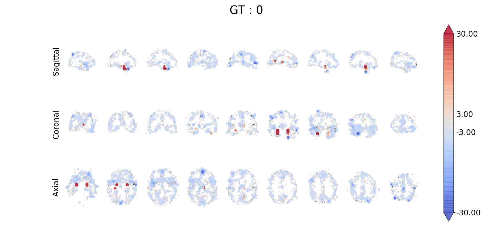
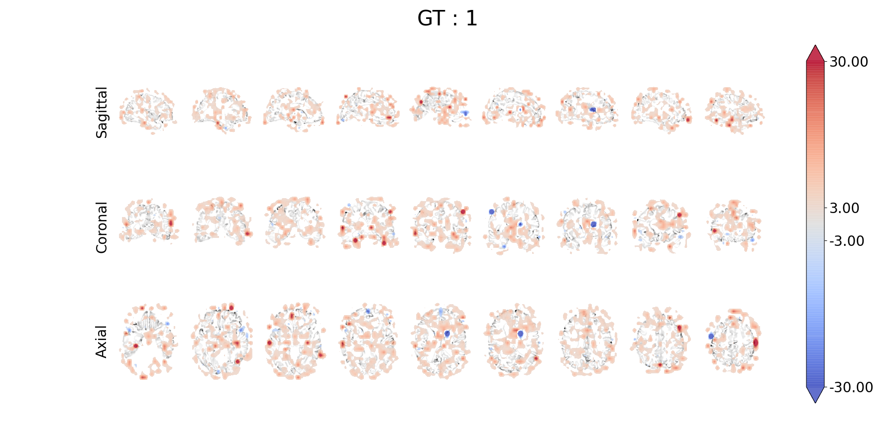

# Bag of Local Feature Model for AD diagnosis

## BagNet
Brendel, Wieland, and Matthias Bethge. "Approximating cnns with bag-of-local-features models works surprisingly well on imagenet." arXiv preprint arXiv:1904.00760 (2019).   
</img>

## Application to the AD diagnosis using sMRI
- Subtle changes captured in patches across the whole brain are key factor to classify disease status.
- Furthermore, to find and show the abnormal region is important in clinical.   

## Experiment results
- Normal 
</img>   
- Alzheimer's disease
</img>
