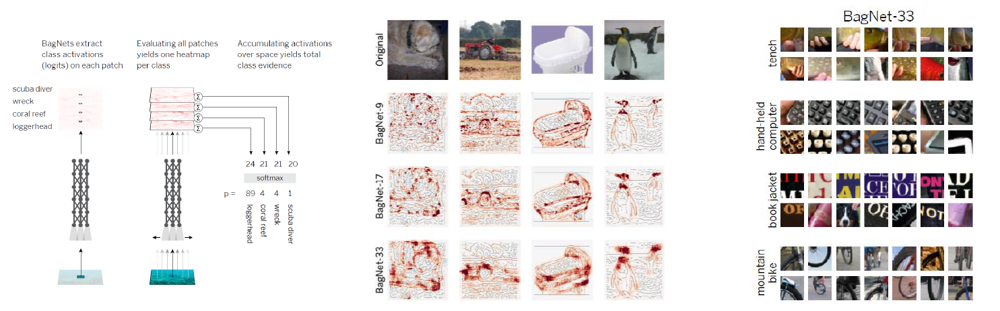

# Bag of Local Feature Model for AD diagnosis

## BagNet
Brendel, Wieland, and Matthias Bethge. "Approximating cnns with bag-of-local-features models works surprisingly well on imagenet." arXiv preprint arXiv:1904.00760 (2019).   
</img>
